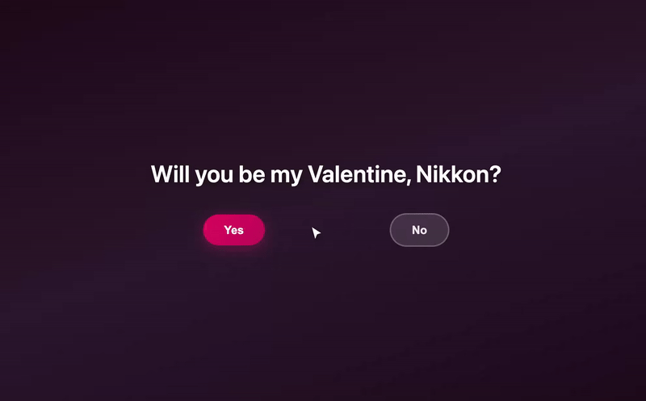

# Be My Valentines

Generate a valentine link, send it—they land on a Yes / No page. If they hover near “No,” a cat pushes the cursor toward “Yes.”

**Demo:** [https://be-my-valentine-f6434.web.app/](https://be-my-valentine-f6434.web.app/)

## Screenshots

**Valentine page** — Yes / No (with the cat)

**Homepage** — generate a link, check status

**Status page** — see if they responded

## Run locally

1. **One-time setup:** Copy `.env.example` to `.env` and add your [Firebase web config](https://console.firebase.google.com) values (see Firebase Hosting below).
2. **Install and build config:** Run `npm install` (this runs `build:config` and generates `public/js/firebase-config.js` from `.env`). If you change `.env` later, run `npm run build:config` again.
3. **Start the app:** Run `npm run serve`. Open the URL shown (usually http://localhost:5000).

You need the [Firebase CLI](https://firebase.google.com/docs/cli) installed. If `firebase` is not found, run `npm install -g firebase-tools`.

## Firebase Hosting

- **Stack:** Hosting + Firestore (client-side), free Spark plan.
- **Config:** Copy `.env.example` → `.env`, add your [Firebase web config](https://console.firebase.google.com) values. `npm run deploy` generates `firebase-config.js` from env and deploys.
- **CI:** Add repo secrets `FIREBASE_API_KEY`, `FIREBASE_PROJECT_ID`, etc. and `FIREBASE_SERVICE_ACCOUNT_BE_MY_VALENTINE_F6434` (service account JSON). Workflow runs `build:config` then deploys on push to `main`.

## Credits

Cats from [Nuko](https://nukochannel.neocities.org).
