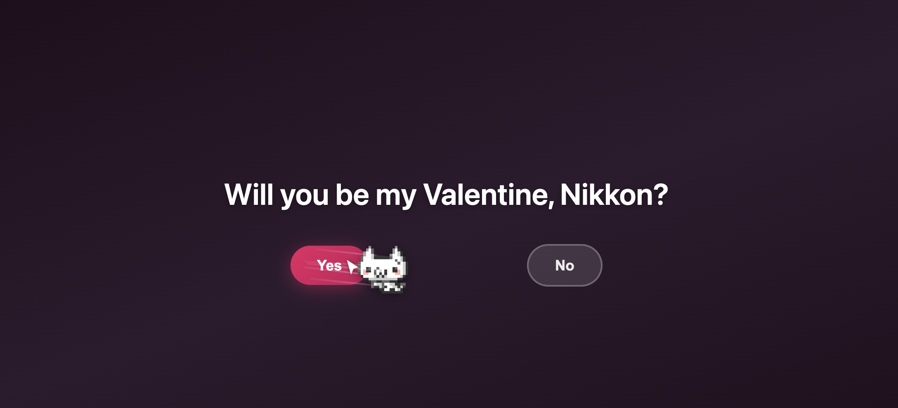
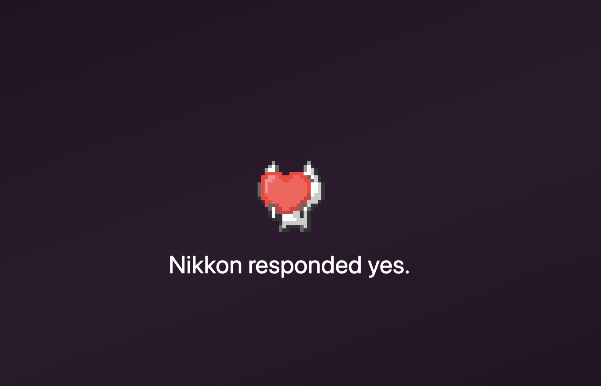

# Be My Valentines

A small Valentine link generator: create a shareable link, send it, and see if they said yes or no.

## Screenshots

**Homepage** — generate a link, check status


**Valentine page** — Yes / No (with the cat)



**Status page** — see if they responded



## Run locally

```bash
npm run serve
```

Or with Hosting + Functions emulators:

```bash
firebase emulators:start --only hosting,functions
```

Open the URL shown (e.g. http://localhost:5000).

## Deploy (Firebase)

```bash
npm run deploy
```

Or `firebase deploy`. Requires Firebase CLI and a project linked via `.firebaserc`.

## Credits

- **Cats from [Nuko](https://nukochannel.neocities.org)** — Nuko Channel button/link in the corner.
